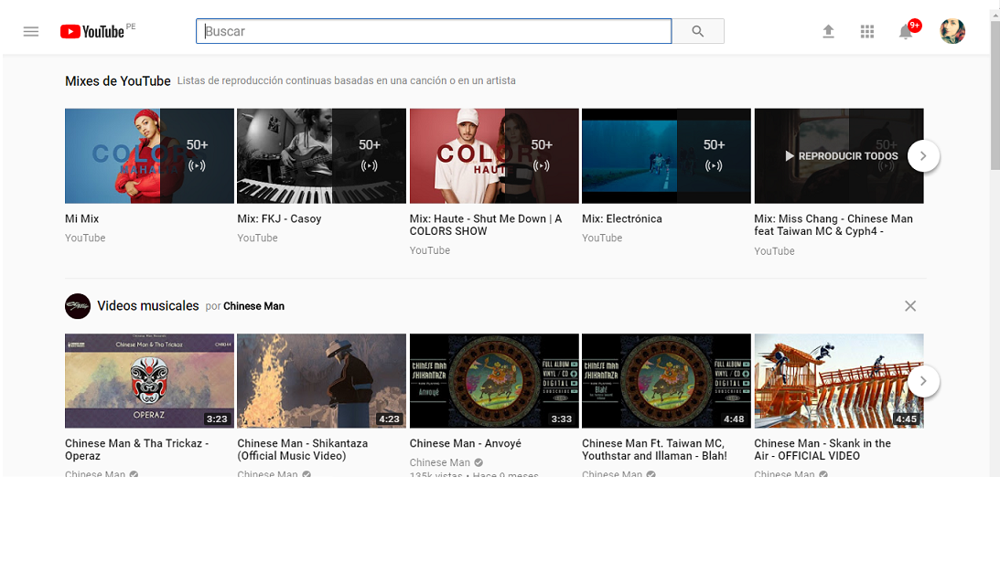

# YOUTUBE

 Explica qué partes conforman el UX y qué partes el UI.

 ## UX
 1. Activacion de subtitulos en los videos.

 2. Suscripciones.

 3. Creacion de canales.

 4. Seccion de videos que recibieron la opcion de "Me Gusta" y "Ver mas tarde".
 
 5. Poder crear listas de reproduccion infinitas.
 
 6. Opcion de "Me Gusta" (dedo pulgar para arriba) y "No Me Gusta" (dedo pulgar para abajo).
 
 7. Seguidores.
 
 8. Tendencias.
 
 9. Videos populares en la pagina de inicio.
 
 10. Recomendaciones.
 
 11. Opciones de visualizacion de la pantalla : completa, modo teatro.
 
 12. Configuracion para cada video : Reproduccion automatica, Anotaciones, Velocidad, Calidad.
 
 13. Comentarios y la opcion de poder ordenarlos segun tiempo y relevancia.
 
 14. Biblioteca personalizada.
 
 15. Creacion de perfil.
 
 16. Opcion para compartir en las redes sociales.
 
 17. Opcion para oscurecer la interfaz para brindar una mejor experiencia nocturna.

 18. Opcion de generar ingresos con Youtube.

 ## UI

 1. Diseño de los botones (iconos de subir un video, apps de youtube, campanita de notificaciones, like, dislike, entre otros).

 2. Numero de veces que el video se vio y cuantos likes y dislikes recibio.

 3. Boton de navegacion global en la parte central superior.

 4. Opciones de parar el video, retroceder y avanzar.

 5. Ver la duracion del video y los videos que siguen.

 6. Boton para subscribirse a los canales es de un color rojo llamativo.

 7. Diseño minimalista de la plataforma de Youtube.
 
 8. Navegacion local dentro de canales.

 9. Menu desplegable de inicio a la izquierda y otro relacionado al perfil a la derecha.

 10. Notificaciones si hay nuevo contenido.

 11. Anuncios de publicidad que no interfieren con la vista de la interfaz.

 

 

